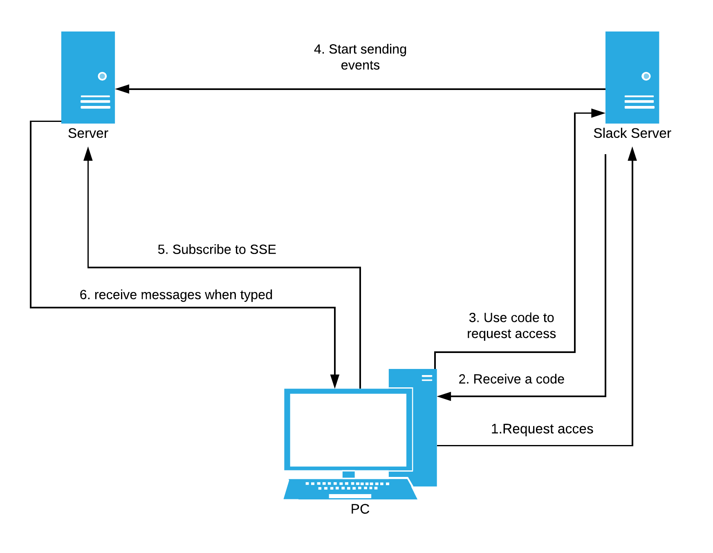

# Real time web project


This little project is 2 game that need 2 people. One person will be in the browser and connect/give access to slack while the other person will be in slack ready to send messages to the other person. When the game starts the person in slack can start sending messages. These will then appear as objects the person in the browser needs to avoid. The more objects he avoids, the higher the score.

### Get started

**NOTE**: You can't run this project locally. The slack api send events to an endpoint that needs to be online.

**.env**

If you still wish to run this project you will need to create an application in slack. From this you will need the following. A `CLIENT` and `CLIENT_SECRET` in the `.env` file. You get these when installing the app. Don't forget to set the scope for the project. This needs to be `im:read` to receive messages.

You will also need to add a `SECRET` to the `.env` file for the `express-session`.

To install you can use both `npm` and `yarn`

```sh
(npm|yarn) install
```

To run as dev. This will start [nodemon] on [http:localhost:8000].

```sh
(npm|yarn) dev
```

Or run normally at [http:localhost:8000].

```sh
(npm|yarn) start
```

[http:localhost:8000]: http:localhost:8000
[nodemon]: http://nodemon.io/

### Data flow

<details>
<summary>The data flow image</summary>



</details>

### Offline

When the server is offline during your session, The SSE stream will show a message of this and try to reconnect every 2 seconds. This is a loop so it will keep doing this untill it ether reconnects or the user closses the page.

When the users internet fails, it will also show a message. Then once the connection is reastablished the message will go away again.

### TODO

- Make it usable for more users at once (And dynamically)
- Handle offline better

### Known bugs

- When the server goes offline, a message will appear saying this. But when the server goes back online, there first needs to be a message send from the slack api before the `open` event on the SSE is called.

### Licensing

This project uses the MIT license.

<!-- ...but how does one use this project? What are its features 🤔 -->
